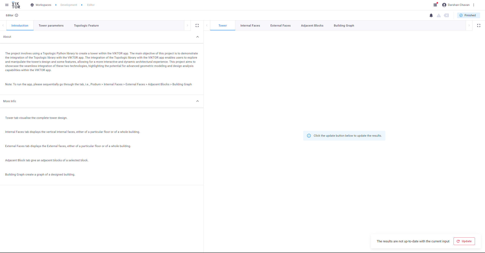

# Topologic Tower

The app demonstrates the use of parametric design to built a tower and to show some of the features. 
 Topolologicpy, a python library is used to create a tower and additionally few functions are used to demonstrate topologicpy potential.

## Overview
When you open the app, the following interface is visible.
on the top-left corner there are three tabs: Introduction, Tower parameters, Topologic Features

Introduction gives a brief information about the app.
Tower parameters tab contains all the parameters by which tower design can be manipulated.
Topologic Features tab contains parameter/inputs to perform topologic features on the tower.

centre-top tabs are used to visualise the Tower and all the other function. The following snaps will go through all the visualisation tabs.

<!-- ### Tab 1- Tower -->
### Tab 1- Tower 

Tower tab visualise the complete tower design.
### Tab 2- Internal Faces
### Tab3- External Faces
### Tab4- Adjacent Blocks
### Tab5- Building Graph

image 