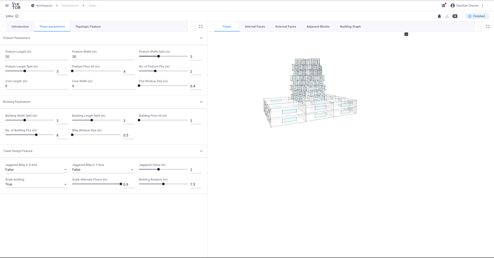

# Topologic Tower

The app demonstrates the use of parametric design to built a tower and to show some of the features. 
 Topolologicpy, a python library is used to create a tower and additionally few functions are used to demonstrate topologicpy potential.

## Overview
When you open the app, the following interface is visible.
on the top-left corner there are three tabs: Introduction, Tower parameters, Topologic Features

Introduction gives a brief information about the app.
Tower parameters tab contains all the parameters by which tower design can be manipulated.
Topologic Features tab contains parameter/inputs to perform topologic features on the tower.

Centre-top tabs are used to visualise the Tower and all the other function. The following snaps will go through all the visualisation tabs.

### Tab 1- Tower

Tower tab visualise the complete tower design.

### Tab 2- Internal Faces

Internal Faces tab displays the vertical internal faces, either of a particular floor or of a whole building.

### Tab3- External Faces

External Faces tab displays the External faces, either of a particular floor or of a whole building.

### Tab4- Adjacent Blocks

Adjacent Block tab give an adjacent blocks of a selected block.

### Tab5- Building Graph

Building Graph create a graph of a designed building.

# Do you want to create an app by yourself?

If you want to try to create an VIKTOR app using the same code, feel free to do so.

## Steps

1. Download the gitub file.
2. Create an account of [VIKTOR](https://www.viktor.ai/start-building-apps).
3. Create an app in your account. For more info visit [VIKTOR Doc link](https://docs.viktor.ai/docs/getting-started/create-first-app)
4. Clear the database with "viktor-cli clear"
5. Install your application with "viktor-cli install"
6. Start your app with "viktor-cli start"
7. Check the app status with "viktor-cli apps"
8. Publish your app by "viktor-cli publish --registered-name <insert-app-name-here> --tag v0.1.0"
9. Go to the your https://cloud.viktor.ai/( The link you get when you start your app[6])
10. Click on Apps > Create Workspace. (For more info click [here](https://docs.viktor.ai/docs/getting-started/publish-app))
11. Currently you an view the app in Development workspace, as it is getting some error when treid to publish. The app is workable but currently having issue while publishing.
12. Workspace>Development> Open to view the app.